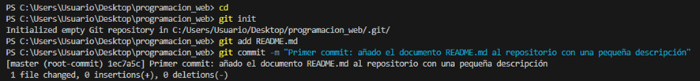
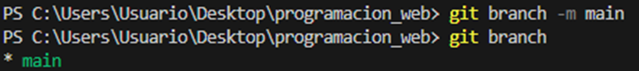
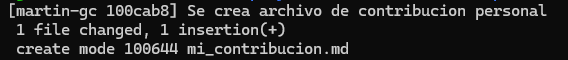
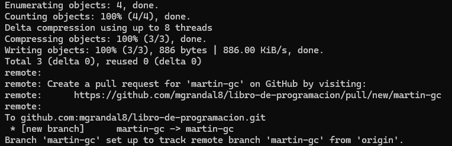

En estos ejercicios he ido utilizando varios comandos como git add, git status, git commit, git merge; que me han servido para manejar las distintas versiones y ramas de mi repositorio. En particular git es una herramienta que utilizo de forma rutinaria en trabajos de programacion que realizo con un amigo de uruguay, pero al haber ido aprendiendo todo de forma autodidacta, muchas veces uno se pierde lo que son los conceptos que hay por detras de cada comando y esta forma de trabajarlo ayuda a que uno pueda alcanzar otra profundidad en el conocimiento o incluso aprender formas mas eficientes para realizar las mismas tareas. Esto por ejemplo me sucedio con la creacion de la clave ssh. Fue algo que cuando empece a utilizar github habia visto, pero no habia entendido mucho como se utilizaba ni para que servia, por lo cual siempre utilice http para vincular repositorios. En una clase aprendi esto y me ha resultado muy util. En particular, en estos ejercicios para la prueba, creo que lo unico que me ha generado una duda fue el tema en el que estamos ahora del fork porque hasta el momento nunca habia utilizado y hasta que fue explicado en la clase no tenia muy claro tampoco para que funcionaba.

