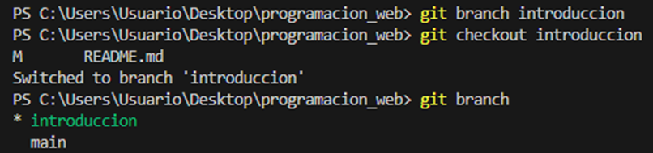
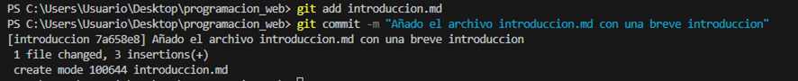

# Resolución de los ejercicios de la primera parte

## Ejercicio 01: Inicializar un repositorio y crear la primera rama

•	Crea una carpeta llamada programacion_web: Aunque se como hacerlo por terminal, suelo usar la interfaz gráfica para la creación de carpetas, documentos, etc.
•	Abre la terminal en esa carpeta e inicializa un repositorio: Con  el comando "cd" y el directorio abrimos la carpeta para luego inicializar mediante "git init" un repositorio.
•	Crea un archivo README.md con una breve descripción del proyecto y haz el primer commit: Una vez creador el archivo y puesto una pequeña descripción se hace una preparacion con "git add README.md" y luego se hace "git commit -m "con un mensaje"" para hacer el commit inicial. 

•	Crea una nueva rama llamada introduccion y cambia a ella: Antes me he asegurado que la rama principal se llamara main dado que por defecto sale como master y creado una nueva rama con "git branch "nombre-de-rama"" para luego desplazarme a ella con "git checkout ""nombre-de-rama"" y por ultimo he comprobado en que rama me encontraba con "git branch".

•	Agrega un archivo introduccion.md con un pequeño texto de introducción y haz un commit: procedo a crear el archivo, llenarlo, hacer "git add "nombre-de-archivo"" para prepararlo y luego "git commit -m "mensaje del commit"".

## Ejercicio 2: Trabajar con múltiples ramas y hacer un merge Fast-Forward

•	En la rama introduccion, agrega más contenido al introduccion.md y haz un commit: edito el documento y hago commit nuevamente de la misma forma que antes.

•	Vuelve a la rama main para hacer un merge Fast-Forward de la rama introduccion: Vuelvo a la rama mediante "git checkout main" y hago el merge con "git merge introduccion"

•	Borra la rama introduccion después del merge. Borramos la rama con: "git branch -d introduccion" y luego comprobamos que ya no hay ninguna rama mas que main.

## Ejercicio 3: Crear una nueva rama y hacer un merge No-Fast-Forward

•	Crea una nueva rama llamada capitulo1: Misma logica que en el ejercicio anterior.

•	Dentro de esta rama, agrega un archivo capitulo1.md con contenido sobre HTML y haz un commit: Nada nuevo que añadir en cuanto a comentario, repetimos procesos anteriores.

•	Vuelve a main, pero haz un commit diferente en main (por ejemplo, edita el README.md): Seguimos.

•	Ahora intenta hacer un merge No-Fast-Forward: La terminal ha hecho cosas raras, sin embargo, una vez ejecutado el comando, todo parece en orden, no ha habido conflicto con el repositorio.

## Ejercicio 4: Hacer un Fork y crear una rama con su nombre

•	Haz un fork del repositorio que compartiré para este ejercicio
    o	Repositorio: libro de programación

•	Clona el fork en tu máquina.

•	Crea una nueva rama con tu nombre y añade las iniciales de tus apellidos en minúsculas con un guión entre noombre e iniciales, así, Pepe Gómez Martínez, tendría la rama pepe-gm.

•	Dentro de esta rama, crea un archivo mi_contribucion.md y escribe una breve descripción de tu experiencia con los ejercicios de Git.
    Nos encontramos en este paso.
    o	Comenta cómo resolviste los ejercicios anteriores (comandos, pasos, etc.). Puedes añadir capturas.
        Todo añadido.
    o	Comenta qué dificultades resolviste
        No he encontrado mayor dificultad.
    o	Si hay algo adicional en tu solución, puedes hacerlo notar aquí.
•	Haz un commit (o más de uno) y sube los cambios a remoto.

    